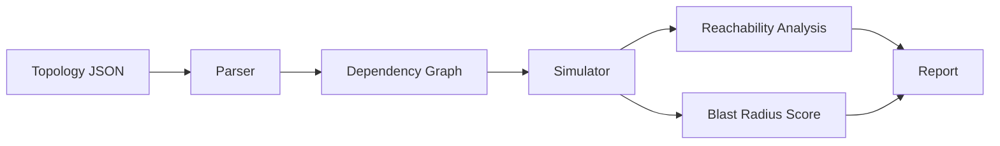

# Sentinel Twin

A small defensive network digital-twin simulator for understanding **blast radius before a real outage happens**.

Instead of probing a live network, Sentinel Twin reads a topology file, models dependencies between routers, switches, services and users, then simulates failures such as a dead link, a failed device or a degraded connection.

## Why I built this

Most beginner networking projects stop at pinging hosts or scanning ports. I wanted something closer to the way an operations engineer thinks during an incident: *if this component fails, what breaks next?*

## What it does

- Models devices and directed dependencies from JSON
- Calculates which assets become unreachable after a simulated failure
- Estimates business blast radius using node criticality
- Supports link degradation with latency and packet-loss penalties
- Produces a human-readable incident report
- Uses only the Python standard library

## Run it

```bash
python sentinel_twin.py sample_topology.json --fail-device core-sw-1
python sentinel_twin.py sample_topology.json --fail-link edge-rtr:core-sw-1
```

## Example topology

The included sample models an internet edge router, core switch, DNS service, application server and employee clients.

## Design



## Safe-use note

Sentinel Twin is a simulator. It does not exploit, attack or modify live devices. Use real infrastructure data only when you are authorized to do so.

## Author

Hanaan Mir — `hanaanmir17`
